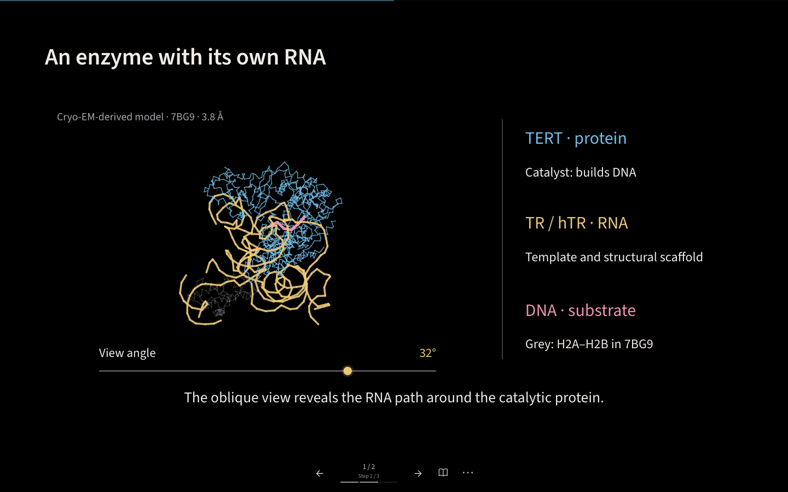

# Visual Lesson Kit

Build scientific explanations as animated, interactive HTML lessons. Start from a working template, combine reusable visual components, and share one self-contained HTML file.

**[Подробное описание на русском](README.ru.md)** · **[Connect to Codex](docs/codex-setup.md)** · **[Authoring guide](docs/START.md)** · **[Examples](examples/README.md)**

Version **0.19.0**. Vanilla JavaScript and SVG at runtime, with WebGL and a Canvas 2D fallback for procedural 3D scenes; Python for project generation and export. No runtime package installation or server is required to view an exported lesson.

## Start with a working lesson

Clone the complete repository and create a lesson:

```sh
git clone https://github.com/eizorerad/visual-lesson-kit.git
cd visual-lesson-kit
python3 create.py ../my-lesson \
  --template molecular-views \
  --title "Telomerase: complex and template" \
  --lang en --palette ocean
python3 ../my-lesson/build/bundle.py
```

You can also use **Code → Download ZIP** on the [GitHub repository](https://github.com/eizorerad/visual-lesson-kit), extract it, and run the Python commands from the extracted folder.

Open `../my-lesson/dist/lesson.html` in a browser. To edit the source with live local serving:

```sh
cd ../my-lesson
python3 serve.py --port 8150
```

Visit `http://127.0.0.1:8150`. Change the lesson's recipe in `js/recipes/`, then rebuild the export. Generated projects contain their own runtime, guides, data and notices, and remain usable independently of the original checkout. The generator refuses to overwrite nonempty folders.

**Prerequisites:** Python 3.10+ for generation and export, and a modern browser for viewing. Node.js is optional and used for development tests; see [Contributing](CONTRIBUTING.md).

## Use with Codex

From the repository root:

```sh
python3 tools/install-codex-skill.py
python3 tools/install-codex-skill.py --check
```

The installer connects the included `visual-lessons` skill to your full local checkout. Then ask Codex:

```text
Use $visual-lessons to create an explanatory lesson about telomerase.
Research primary sources. Start with molecular-views: show the complex,
then the RNA/DNA detail, using the same source coordinates.
Explain each transformation, keep RU/EN text, and check the exported HTML
in a browser. Create the project outside the library directory.
```

Read the [complete setup guide](docs/codex-setup.md) for installation scope, relocation, existing skills, troubleshooting and browser verification. This is a local library and skill; it does not require an MCP server or an API key of its own.

## What you can assemble



[See the atomic detail view](docs/images/molecular-detail.png) · [Run the two-scene example locally](examples/molecular-views.html)

| Template | Starting point |
| --- | --- |
| `spatial-biology` | Procedural 3D cell labelling, bead/droplet capture, barcode–feature–UMI explanation and paired RNA/ADT libraries |
| `molecular-views` | Coordinate-backed complex overview and atomic detail, fitted camera, rotation, shared depth ordering and source provenance |
| `trna-journey` | Continuous 6:38 tRNA film; remix named episodes, timing and RU/EN captions; atomic stem, D/T contacts, Mg/water and space-filling spheres |
| `rna-prediction` | Motif energies and alignment evidence → pair topology → 2D and schematic 3D; 20 scenes, 91 states, verified ViennaRNA data |
| `rna-folding` | Connected 17-scene explanation of RNA structure and folding concepts |
| `molecular` | Schematic DNA, proteins, CRISPR, chromatin and RNA-processing actors |
| `molecular-check` | Seven molecular elements with authored motion and close-up inspection |
| `chemistry-bridge` | 16 visual stories connecting chemistry to biological mechanisms |
| `methods` | Statistical, biological and geometric operations |
| `explanations` | Connected comparisons, distributions and stepwise derivations |
| `synthesis` | A recurring map linking model, observations and verification |
| `gallery` | General component gallery and teaching patterns |

The shared shell provides Russian/English switching, black/white backgrounds, three palettes, two text fonts, step navigation, reading notes and questions. Motion utilities preserve object identity; layout and interaction audits help find problems before export.

The separate [3D biology section](docs/three-dimensional.md) provides reusable `V3` molecule meshes, cell surfaces, capture beads, primers, droplets and barcode records. Start with `python3 create.py ../my-3d-lesson --template spatial-biology --lang en --palette ocean` for three complete editable scenes (24 states); [open the standalone example locally](examples/spatial-biology.html). Geometry, visible molecule counts and trajectories are illustrative. The template follows the original solid-bead Drop-seq CITE-seq workflow and distinguishes co-capture from later synthesis. All components and recipes travel with new projects; other templates do not load these scenes.

The [RNA prediction template](docs/rna-prediction.md) preserves a continuous causal narrative and its pacing. Create it with `python3 create.py ../my-rna-prediction --template rna-prediction --palette ocean`; [open the standalone example locally](examples/rna-prediction.html). The [indexed RNA actor](docs/rna-pair-molecule.md) and [visual/motion style recipe](docs/cinematic-explanation.md) can be reused independently.

The molecular constructor combines two high-level presets—`MolecularScenes.overview` and `MolecularScenes.detail`—with lower-level trace, fragment, camera, locator and control components. Follow the [assembly recipe](docs/molecular-views.md), [API](docs/molecular-views-api.md) and [PDB import guide](docs/molecular-data.md). Rotating source coordinates changes the view; it does not compute a folding trajectory or molecular dynamics.

## Find the right component

```sh
python3 docs/navigation/route.py "protein RNA complex 3D"
python3 docs/navigation/route.py --show molecular-views
python3 docs/navigation/route.py --tree
```

The selector reads a compact metadata catalog. Open the returned guide sections before inspecting implementation files. Start with a viewer's question and choose a visual operation that explains it; templates are editable examples, not mandatory presentation outlines.

## Development and attribution

[Contributing](CONTRIBUTING.md) lists test and browser-check commands.

Visual Lesson Kit is authored by **Leonid Klarov** ([eizorerad](https://github.com/eizorerad), [eizonix@gmail.com](mailto:eizonix@gmail.com)) and released under the [MIT License](LICENSE). Bundled fonts and structural data retain their separate terms and scientific attribution; see [third-party notices](THIRD_PARTY_NOTICES.md) and [provenance](docs/provenance.md).

## Repeat or remix the tRNA film

```sh
python3 create.py ../my-trna-film --template trna-journey --palette ocean
python3 ../my-trna-film/build/bundle.py
```

[Open the standalone example locally](examples/trna-journey.html). Edit `js/trna-config.js` to select/reorder episodes and change motion, reading holds and bilingual text; the empty configuration retains all 39 cues and 398 seconds. The [assembly guide](docs/trna-journey.md) includes a complete shorter variant and component map. [CinemaTimeline](docs/cinema-timeline.md) can also pace explanations unrelated to RNA. Source coordinates and scientific caveats travel with the template.
